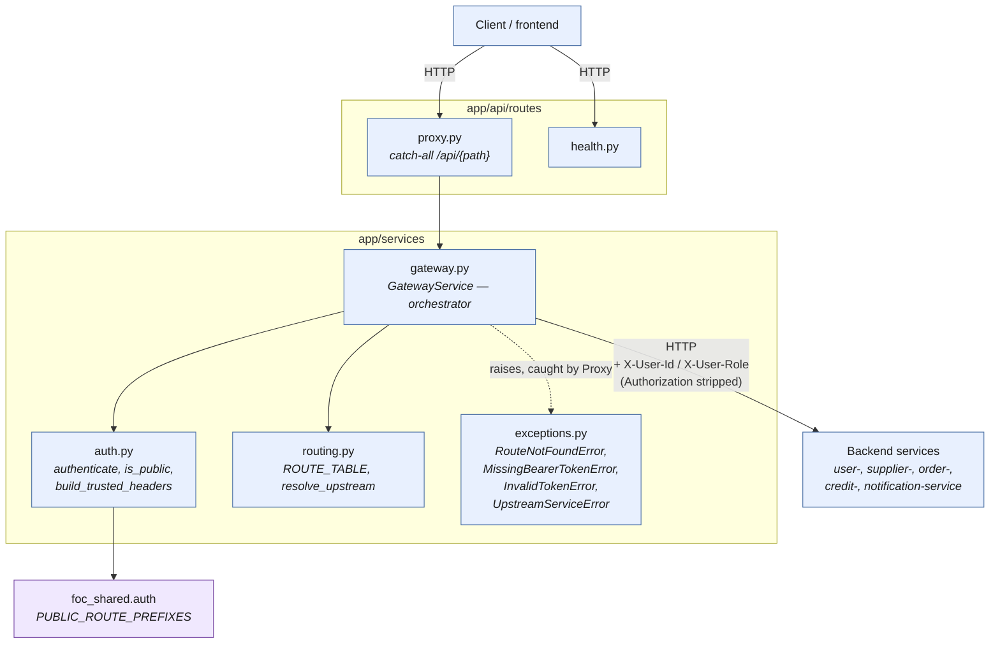

# api-gateway Architecture

Internal architecture of **api-gateway** only. For how this service fits
among the others, see the repo-root `docs/architecture.md`;

## Style

Layered the same way as the domain services — `api/routes` (HTTP) →
`services` (business logic) — but with **no `repositories`/`models`
layer**: the gateway has no database of its own (per `AGENTS.md`), so there
is nothing to persist. Its only external dependency is the backend services
it proxies to, over HTTP.

## Components

| Component | File | Responsibility |
| --- | --- | --- |
| Proxy route | `app/api/routes/proxy.py` | The catch-all `/api/{path:path}` handler. HTTP-only: calls `GatewayService`, maps its domain exceptions to ErrorEnvelope-shaped JSON responses with the right status code. No routing/auth/forwarding logic lives here. |
| Health route | `app/api/routes/health.py` | `GET /health` liveness check. |
| Orchestrator | `app/services/gateway.py` (`GatewayService`) | The only component that sequences the three steps of handling one request: resolve the upstream, authorize the caller, forward the request. Owns the header-stripping rules on both the request and response side. |
| Auth | `app/services/auth.py` | `authenticate()` (JWT verify), `is_public()`, `build_trusted_headers()`. Uses the public-route list from `foc_shared.auth`; route matching remains in this gateway module. |
| Routing | `app/services/routing.py` | `ROUTE_TABLE` (path prefix → backend base URL) and `resolve_upstream()`. Pure lookup, no I/O. |
| Exceptions | `app/services/exceptions.py` | `RouteNotFoundError`, `MissingBearerTokenError`, `InvalidTokenError`, and `UpstreamServiceError` — routes catch these in one place. |
| Config | `app/config.py` | Env-driven settings: `jwt_secret`, backend service URLs. |

## Diagram

### Title: api-gateway internal layers and external boundaries

### Legend

| Symbol | Meaning |
| --- | --- |
| Rounded box (blue) | In-process, synchronous component within this service |
| Rounded box (purple) | External shared package (`foc_shared`), not owned by this service |
| Solid arrow | Direct function call |
| Dashed arrow | Exception raised by the callee, caught by the caller |

### Explained elements

- **`proxy.py` never touches routing, auth, or `httpx` directly.** It calls
  `GatewayService` and translates four domain exceptions into HTTP responses
  (404, 401 ×2, and 502). This mirrors user-service's routes-only-translate
  convention — one place decides the status-code mapping, not one per
  handler.
- **`GatewayService.resolve()` runs before `.authorize()`.** An unknown
  route 404s regardless of whether a token was sent; a known-but-protected
  route only then checks auth. This ordering is deliberate and matches the
  original proxy's behavior — it must not be reordered casually, since it
  changes what an attacker probing for valid paths can infer from status
  codes.
- **`auth.py` doesn't own the public-route list.** `PUBLIC_ROUTE_PREFIXES`
  lives in `foc_shared.auth`, while `auth.py` owns the matching logic and JWT
  verification. This keeps the public contract shared without moving gateway
  behavior into the shared package.
- **No repositories/models layer.** Nothing here is persisted; the gateway
  is stateless by design. The "external boundary" for this service is
  entirely outbound HTTP to backend services, not a database.
- **Response error shape is shared, not local.** The gateway returns JSON with
  the shared `ErrorEnvelope` fields (`code`, `message`) from
  `foc_shared.errors`, so clients can parse one error shape everywhere.
