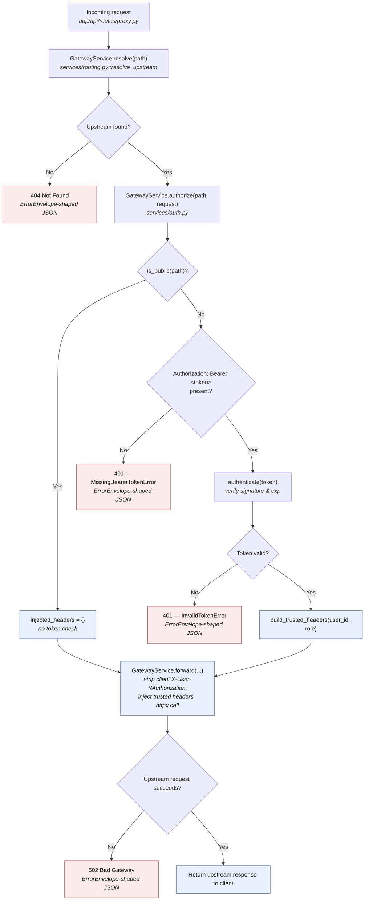

# api-gateway Request Flow

Companion to `architecture.md`. Where the repo-root `docs/flowchart.md`
covers the login handshake and the OTP lifecycle (user-service's side), this
covers what happens **inside api-gateway** for every proxied request, now
grounded in the layered `services/` module split.

## 1. Full proxy request pipeline

### Title: GatewayService orchestration for one /api/{path} request

**Legend:** blue = handled successfully, request proceeds; red = rejected,
`proxy.py` returns immediately without calling `GatewayService.forward()`.

**Explained elements**

- **Route resolution happens before authorization**, both in the diagram and
  in `proxy.py`'s call order. `RouteNotFoundError` short-circuits before
  `GatewayService.authorize()` is even called — an invalid path 404s
  whether or not the caller sent a token.
- **`authenticate()` still never raises** — it returns `None` on any
  failure (missing/expired/malformed/bad signature), exactly as before the
  refactor. `GatewayService.authorize()` is the layer that turns that `None`
  into `InvalidTokenError`; `authenticate()` itself stays a pure,
  non-raising verifier so a bad token can never crash the proxy outright.
- **All four gateway exceptions are caught in exactly one place** —
  `app/api/routes/proxy.py` — and turned into ErrorEnvelope-shaped JSON with
  the matching status code. No handler duplicates that mapping.
- **Header stripping happens in `GatewayService.forward()`**, on both
  sides: client-supplied `Authorization` and `X-User-*` headers are
  stripped before forwarding (preventing role spoofing), and hop-by-hop
  response headers (`Content-Length`, `Transfer-Encoding`, `Connection`)
  are stripped before returning the upstream response to the client.
