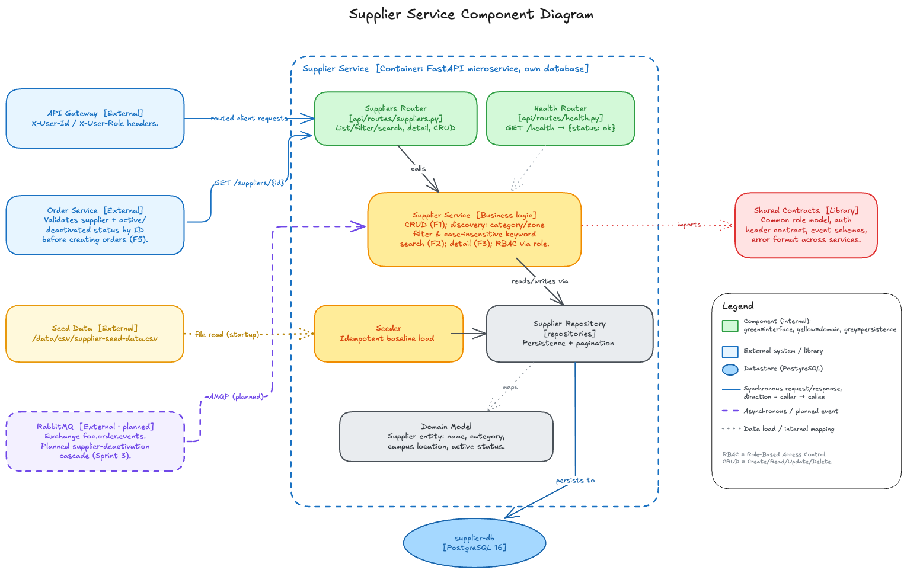

# Architecture

> Placeholder for the FoC architecture documentation. Keep the diagram source
> here and export an image for slides/README.

## Style

Distributed, **domain-partitioned microservices** (per CS3219 L4/L6): each
business domain (User, Supplier, Order, Credit, Notification) is an
independently deployable service with its own database. Services are
internally **layered** (`api/routes` → `services` → `repositories`).

## Components

| Component | Responsibility | Data store | Sync/Async |
| --------- | -------------- | ---------- | ---------- |
| api-gateway | Single entry point; edge auth + RBAC; routing | — | sync (HTTP) |
| user-service | Registration, auth, RBAC, profile | user-db | sync + publishes events |
| supplier-service | Supplier CRUD, discovery, seeding | supplier-db | sync |
| order-service | Errand lifecycle + state machine | order-db | sync + publishes events |
| credit-service | Closed credit economy | credit-db | sync + consumes events |
| notification-service | User notifications | notification-db | consumes events |
| frontend | Responsive SPA (requester/courier/admin) | — | sync (HTTP) |
| rabbitmq | Event broker | — | async |

## Diagram

### Supplier Service (C4 Level 3 — Component)

<!-- AI-influenced: diagram drafted with OpenCode (Claude Opus); see ai/usage-log.md -->

Source: `supplier-service-architecture.svg` (scalable) and the editable
`supplier-service-architecture.excalidraw.json`. Built to the L6 "Guidelines
for Architecture Diagrams": titled + labelled, legend explaining notation,
acronyms expanded (RBAC, CRUD), each element described in 1–2 lines, and every
relationship labelled with direction + intent.

This is a **design-level** view: it describes the service's responsibilities
and interactions rather than its implementation. Internally the service is
layered **Interface → Domain → Persistence**:

- **API / Interface Layer** — exposes supplier operations, validates input, and
  enforces RBAC using the role passed by the gateway.
- **Supplier Domain Logic** — CRUD & lifecycle (activate/deactivate), discovery
  (category/zone filtering + keyword search), single-supplier lookup, and
  status validation for other services.
- **Data Seeding** — one-time idempotent load of the baseline catalog.
- **Persistence Layer** + **Domain Model** — data access/queries with pagination
  over the `Supplier` entity (name, category, campus location, active status).

External relationships: the **API Gateway** (sole entry for client traffic,
supplies verified identity + role), the **Order Service** (validates a supplier
by ID before creating orders), the read-only **baseline catalog data**, the
shared **contracts library**, and **RabbitMQ** (dashed — the planned Sprint 3
supplier-deactivation cascade). State is persisted to the service-owned
`supplier-db`.

TODO (other services): add matching component diagrams for user-, order-,
credit-, and notification-service, plus a system-level Container (C4 L2) view.
A text sketch lives in the root `README.md`.

## Key decisions (fill in — team-authored, not AI)

- Why microservices vs modular monolith.
- Database-per-service rationale.
- RabbitMQ as the async backbone; which flows are eventually consistent.
- API gateway as the sole public entry point.
