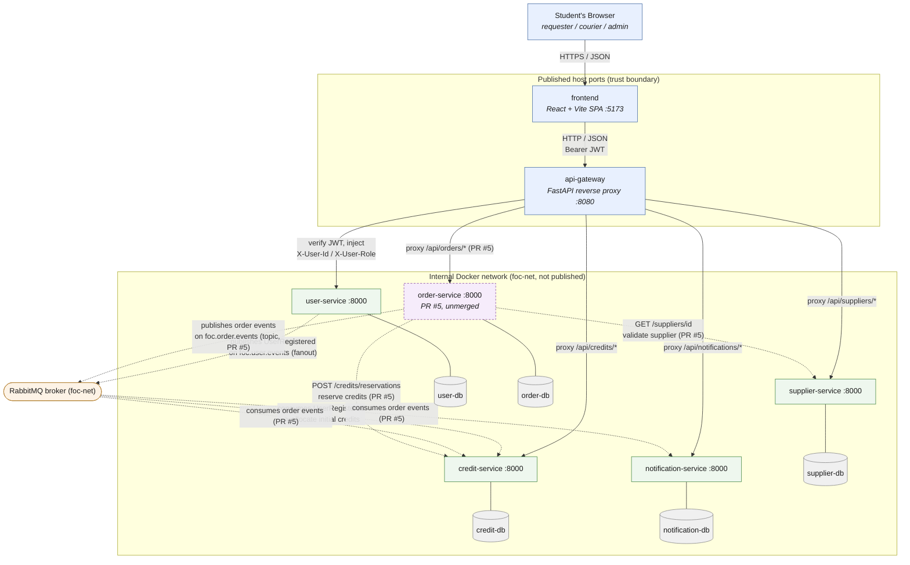
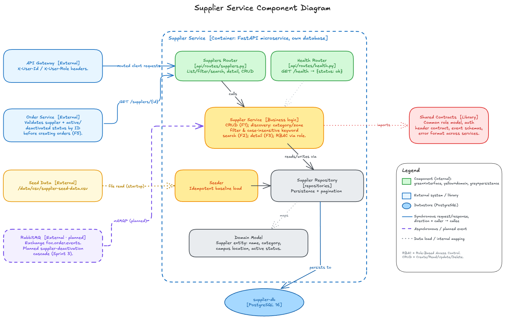

# Architecture

> Placeholder for the FoC architecture documentation. Keep the diagram source
> here and export an image for slides/README.

## Style

Distributed, **domain-partitioned microservices** (per CS3219 L4/L6): each
business domain (User, Supplier, Order, Credit, Notification) is an
independently deployable service with its own database. Services are
internally **layered** (`api/routes` → `services` → `repositories`).

## Components

| Component | Responsibility | Data store | Sync/Async |
| --------- | -------------- | ---------- | ---------- |
| api-gateway | Single public entry point; edge authentication (JWT verify) + trusted-header injection; routing | — | sync (HTTP) |
| user-service | Registration, authentication (JWT issue), profile, admin user management | user-db | sync + publishes events |
| supplier-service | Supplier CRUD, discovery, seeding | supplier-db | sync |
| order-service | Errand lifecycle + state machine | order-db | sync + publishes events |
| credit-service | Closed credit economy | credit-db | sync + consumes events |
| notification-service | User notifications | notification-db | consumes events |
| frontend | Responsive SPA (requester/courier/admin) | — | sync (HTTP) |
| rabbitmq | Event broker | — | async |

> **Where RBAC lives.** The gateway *authenticates* (verifies the JWT and
> injects trusted `X-User-Id` / `X-User-Role` headers); it does **not** make
> per-route role decisions — `ROUTE_TABLE` in
> `api-gateway/app/services/routing.py` is a plain path-prefix map with no role
> metadata. Role checks (admin-only operations) are enforced **inside each
> service** using the trusted role header. See [`rbac.md`](./rbac.md).

## Diagram

### Title: FoC system containers (C4 Level 2 — Container)

<!-- AI-influenced: diagram drafted with OpenCode (Claude Opus); see ai/usage-log.md -->

C4 = Context/Container/Component/Code model. This is the **Container** view:
each deployable process (frontend, gateway, the five FastAPI services, their
PostgreSQL databases, and the RabbitMQ broker) and the relationships between
them, grounded in `compose.yaml`, `.env.example`, and the service code.

```mermaid
flowchart TB
    Browser["Student's Browser<br/><i>requester / courier / admin</i>"]

    subgraph PUB["Published host ports (trust boundary)"]
        direction TB
        FE["frontend<br/><i>React + Vite SPA :5173</i>"]
        GW["api-gateway<br/><i>FastAPI reverse proxy :8080</i>"]
    end

    subgraph INT["Internal Docker network (foc-net, not published)"]
        direction TB
        US["user-service :8000"]
        SUP["supplier-service :8000"]
        ORD["order-service :8000<br/><i>PR #5, unmerged</i>"]
        CR["credit-service :8000"]
        NOT["notification-service :8000"]

        USDB[("user-db")]
        SUPDB[("supplier-db")]
        ORDDB[("order-db")]
        CRDB[("credit-db")]
        NOTDB[("notification-db")]
    end

    MQ(["RabbitMQ broker (foc-net)"])

    Browser -->|"HTTPS / JSON"| FE
    FE -->|"HTTP / JSON<br/>Bearer JWT"| GW

    GW -->|"verify JWT, inject<br/>X-User-Id / X-User-Role"| US
    GW -->|"proxy /api/suppliers/*"| SUP
    GW -->|"proxy /api/orders/* (PR #5)"| ORD
    GW -->|"proxy /api/credits/*"| CR
    GW -->|"proxy /api/notifications/*"| NOT

    US --- USDB
    SUP --- SUPDB
    ORD --- ORDDB
    CR --- CRDB
    NOT --- NOTDB

    US -.->|"publishes UserRegistered<br/>on foc.user.events (fanout)"| MQ
    MQ -.->|"consumes UserRegistered<br/>-> allocate initial credits"| CR

    ORD -.->|"publishes order events<br/>on foc.order.events (topic, PR #5)"| MQ
    MQ -.->|"consumes order events (PR #5)"| CR
    MQ -.->|"consumes order events (PR #5)"| NOT

    ORD -.->|"GET /suppliers/id<br/>validate supplier (PR #5)"| SUP
    ORD -.->|"POST /credits/reservations<br/>reserve credits (PR #5)"| CR

    classDef pub fill:#e8f0fe,stroke:#4a6fa5,color:#1a1a1a;
    classDef svc fill:#eef7ee,stroke:#4a8a4a,color:#1a1a1a;
    classDef store fill:#f0f0f0,stroke:#888,color:#1a1a1a;
    classDef async fill:#fdf3e6,stroke:#b8863a,color:#1a1a1a;
    classDef planned fill:#f6ecfb,stroke:#8a4aa5,color:#1a1a1a,stroke-dasharray:4 3;
    class Browser,FE,GW pub;
    class US,SUP,CR,NOT svc;
    class ORD planned;
    class USDB,SUPDB,ORDDB,CRDB,NOTDB store;
    class MQ async;
```

### Legend

| Symbol | Meaning |
| --- | --- |
| Blue box | Container whose host port is **published** (the trust boundary: only `frontend` :5173 and `api-gateway` :8080 are reachable from outside the Docker network). |
| Green box | Backend FastAPI service, reachable only on the internal `foc-net` network (`:8000` in-container). |
| Purple dashed box | `order-service` — exists only on branch `origin/implementation/order-service` (**PR #5, not merged**). |
| Cylinder (grey) | A service-owned PostgreSQL database (DB-per-service; no service touches another's DB). |
| Stadium (orange) | The RabbitMQ event broker. |
| Solid arrow | Synchronous HTTP call, labelled with intent. |
| Dashed arrow | Asynchronous event flow (AMQP) **or** an as-yet-unmerged PR #5 relationship, labelled `PR #5`. |

### Explained elements

- **The gateway is the only public HTTP entry point.** Every client call goes
  `Browser -> frontend -> api-gateway`, and only the gateway forwards to
  backends. It verifies the JWT and injects the trusted `X-User-Id` /
  `X-User-Role` headers (stripping any client-supplied copies) before proxying;
  it does not itself decide admin-vs-client per route (see
  [`rbac.md`](./rbac.md)). RBAC = Role-Based Access Control.
- **Trust boundary = published ports.** Per `compose.yaml`, only `frontend`
  (`5173`) and `api-gateway` (`8080`, mapped to in-container `8000`) publish
  host ports; the five services and their databases sit on the internal
  `foc-net` bridge network and are not directly reachable.
- **Database-per-service.** Each service owns one PostgreSQL database and never
  reads another's. Cross-service data is exchanged only over HTTP APIs or
  events — e.g. `order-service` references `supplier_id` by value, with no
  foreign key across databases.
- **`UserRegistered` is the D2 async flow that already works.** On email
  verification `user-service` writes an outbox row and its background relay
  publishes `UserRegistered` to the `foc.user.events` **fanout** exchange
  (`app/services/events.py`); `credit-service` consumes it and provisions the
  initial credit balance (`app/services/consumer.py`). Drawn **solid** because
  the publish path is implemented, not planned.
- **Everything labelled `PR #5` is dashed.** `order-service` and the order
  event flows on `foc.order.events` (topic) — plus its synchronous
  `GET /suppliers/{id}` (validate supplier) and `POST /credits/reservations`
  (reserve credits) calls — live only on the unmerged
  `implementation/order-service` branch (`app/clients/suppliers.py`,
  `app/clients/credits.py`). They are shown for context but are not yet on
  `main`.

### Supplier Service (C4 Level 3 — Component)

<!-- AI-influenced: diagram drafted with OpenCode (Claude Opus); see ai/usage-log.md -->

Source: `supplier-service-architecture.svg` (scalable). Built to the L6
"Guidelines for Architecture Diagrams": titled + labelled, legend explaining notation,
acronyms expanded (RBAC, CRUD), each element described in 1–2 lines, and every
relationship labelled with direction + intent.

This is a **design-level** view: it describes the service's responsibilities
and interactions rather than its implementation. Internally the service is
layered **Interface → Domain → Persistence**:

- **API / Interface Layer** — exposes supplier operations, validates input, and
  enforces RBAC using the role passed by the gateway.
- **Supplier Domain Logic** — CRUD & lifecycle (activate/deactivate), discovery
  (category/zone filtering + keyword search), single-supplier lookup, and
  status validation for other services.
- **Data Seeding** — one-time idempotent load of the baseline catalog.
- **Persistence Layer** + **Domain Model** — data access/queries with pagination
  over the `Supplier` entity (name, category, campus location, active status).

External relationships: the **API Gateway** (sole entry for client traffic,
supplies verified identity + role), the **Order Service** (validates a supplier
by ID before creating orders), the read-only **baseline catalog data**, the
shared **contracts library**, and **RabbitMQ** (dashed — the planned Sprint 3
supplier-deactivation cascade). State is persisted to the service-owned
`supplier-db`.

The system-level Container (C4 L2) view above shows how this service fits
among the others. TODO (other services): add matching component diagrams for
user-, order-, credit-, and notification-service. Related design views:
[`rbac.md`](./rbac.md) (role → capability matrix + supplier-write sequence),
`user-service/docs/architecture.md` (user_db data model), and
`supplier-service/docs/data-model.md` (supplier_db data model).

## Key decisions (fill in — team-authored, not AI)

- Why microservices vs modular monolith.
- Database-per-service rationale.
- RabbitMQ as the async backbone; which flows are eventually consistent.
- API gateway as the sole public entry point.
