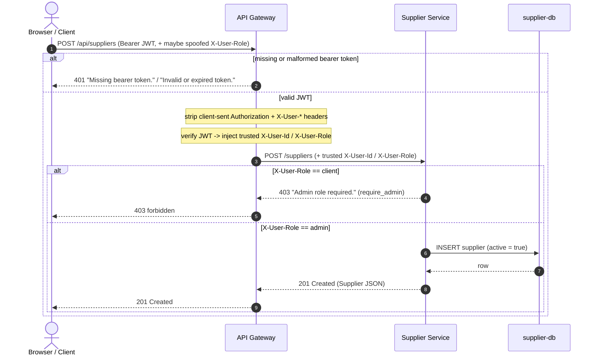

# RBAC — Roles, Capabilities & Enforcement

<!-- AI-influenced: tables + diagram drafted with OpenCode (Claude Opus); see ai/usage-log.md -->

Living reference for **Role-Based Access Control (RBAC)** across the FoC APIs.
Roles come from `foc_shared.auth.Role`: `admin` and `client`. Every row is
derived from the code, not from other docs; where a route exists only on the
unmerged order-service branch it is marked **planned (PR #5)**.

## How enforcement works

Authentication and authorization are split between two layers:

1. **The API Gateway authenticates only.** For any non-public `/api/*` route it
   requires a `Bearer` JWT, verifies it (`api-gateway/app/services/auth.py::authenticate`),
   and on success injects trusted `X-User-Id` / `X-User-Role` headers, having
   first **stripped** any client-supplied copies of those headers and the
   `Authorization` header (`api-gateway/app/services/gateway.py`). A missing
   token yields `401 "Missing bearer token."`; an invalid/expired token yields
   `401 "Invalid or expired token."`. The gateway does **not** decide
   admin-vs-client per route — `ROUTE_TABLE` (`app/services/routing.py`) is a
   plain path-prefix map with no role metadata.
2. **Each service enforces the role.** The admin-vs-client decision lives in the
   backend service, reading the trusted `X-User-Role`:
   - user-service: `_require_admin(...)` in `app/api/routes/users.py`.
   - supplier-service: `require_admin(...)` dependency in `app/api/deps.py`
     (raises `UnauthorizedError` → 401 when identity headers are absent,
     `ForbiddenError` → 403 `"Admin role required."` for a non-admin).

Public routes (`foc_shared.auth.PUBLIC_ROUTE_PREFIXES`) bypass step 1 entirely:
`/health`, `/api/users/register`, `/api/users/login`, `/api/users/otp/verify`,
`/api/users/otp/resend`.

## Role → capability matrix

`401` = no/invalid token (rejected at the gateway before the service is
reached). `403` = authenticated but wrong role (rejected in the service).
"Own only" = allowed for the caller's own record via the injected `X-User-Id`.

| Operation (method + path) | Public / no token | `client` | `admin` | Enforced by |
| --- | --- | --- | --- | --- |
| `GET /health` | allowed | allowed | allowed | public route |
| `POST /api/users/register` | allowed | allowed | allowed | public route |
| `POST /api/users/otp/verify` | allowed | allowed | allowed | public route |
| `POST /api/users/otp/resend` | allowed | allowed | allowed | public route |
| `POST /api/users/login` | allowed | allowed | allowed | public route |
| `GET /api/users/me` | 401 | allowed (own) | allowed (own) | gateway authn; `X-User-Id` in `users.py::get_profile` |
| `PATCH /api/users/me` | 401 | allowed (own) | allowed (own) | gateway authn; `X-User-Id` in `users.py::update_profile` |
| `POST /api/users/admin` | 401 | 403 | allowed | `users.py::_require_admin` |
| `GET /api/users/admin` | 401 | 403 | allowed | `users.py::_require_admin` |
| `POST /api/users/admin/{id}/suspend` | 401 | 403 | allowed¹ | `users.py::_require_admin` (+ 400 self / admin target) |
| `POST /api/users/admin/{id}/unsuspend` | 401 | 403 | allowed¹ | `users.py::_require_admin` (+ 400 admin target) |
| `PATCH /api/users/admin/{id}/role` | 401 | 403 | allowed¹ | `users.py::_require_admin` (+ 400 self-demote / last-admin) |
| `GET /api/suppliers` | 401 | allowed | allowed | gateway authn (any authenticated role) |
| `GET /api/suppliers/{id}` | 401 | allowed | allowed | gateway authn (any authenticated role) |
| `POST /api/suppliers` | 401 | 403 | allowed | `deps.py::require_admin` |
| `PATCH /api/suppliers/{id}` | 401 | 403 | allowed | `deps.py::require_admin` |
| `POST /api/suppliers/{id}/deactivate` | 401 | 403 | allowed | `deps.py::require_admin` |
| `POST /api/suppliers/{id}/reactivate` | 401 | 403 | allowed | `deps.py::require_admin` |
| `GET /api/orders` *(planned, PR #5)* | 401 | allowed (own) | allowed | order-service (planned) |
| `POST /api/orders` *(planned, PR #5)* | 401 | allowed | allowed | order-service (planned) |
| `POST /api/orders/{id}/accept` *(planned, PR #5)* | 401 | allowed (courier) | allowed | order-service (planned) |
| `POST /api/orders/{id}/cancel` *(planned, PR #5)* | 401 | allowed (own) | allowed | order-service (planned) |

¹ Admin-only, with additional business guards that return `400` (not `403`):
an admin cannot suspend or demote **itself**, an admin account cannot be
suspended via this route, and the **last** non-suspended admin cannot be
demoted (`app/services/user.py::set_suspended`, `set_role`).

> Order-service rows are **planned (PR #5)**: the routes and their exact role
> rules live only on `origin/implementation/order-service` and are not yet on
> `main`; the client/courier/owner semantics shown are indicative.

## Sequence: authenticated supplier write (admin-only create)

### Title: `POST /api/suppliers` — gateway authn then service RBAC

<!-- AI-influenced: diagram drafted with OpenCode (Claude Opus); see ai/usage-log.md -->

### Legend

| Element | Meaning |
| --- | --- |
| `actor` | The external caller (browser / API client). |
| Solid arrow `->>` | Synchronous request to the next participant. |
| Dashed arrow `-->>` | Response returned to the caller. |
| `alt` / `else` | Mutually exclusive branches; the taken branch depends on the token / role. |
| `Note over GW` | Gateway-side processing that produces no separate message. |

### Explained elements

- **Header spoofing is defeated at the gateway.** Even if the client sends
  `X-User-Role: admin`, the gateway strips it (it is in the request
  header-strip set) and re-injects the role taken from the verified JWT, so a
  client stays a client. This is exercised by the Postman `03 RBAC evidence`
  folder.
- **401 vs 403 are produced by different layers.** The `401` (missing/invalid
  token) is returned by the **gateway** before supplier-service is ever called;
  the `403 "Admin role required."` is returned by **supplier-service**'s
  `require_admin` after the gateway has authenticated the caller. Distinguishing
  the two is deliberate (defence in depth; backlog N4).
- **Only `admin` reaches the database.** The `INSERT` happens solely on the
  `admin` branch; a `client` request never touches `supplier-db`.
