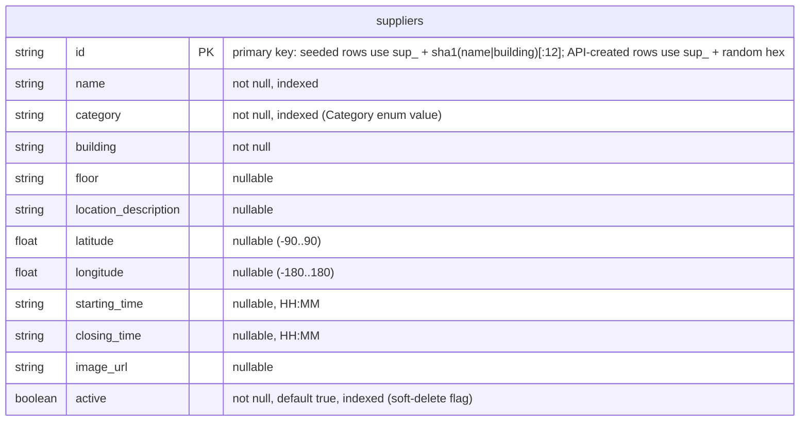

# supplier-service Data Model

Data model of **supplier-service** only. For how this service fits among the
others, see the repo-root [`docs/architecture.md`](../../docs/architecture.md);
for the API contract see [`docs/supplier-service-api.md`](../../docs/supplier-service-api.md).

## Data model

### Title: supplier-db entity–relationship diagram (`suppliers`)

<!-- AI-influenced: diagram drafted with OpenCode (Claude Opus); see ai/usage-log.md -->

Every column below is taken directly from the ORM model in
`app/models/supplier.py`. `supplier-db` holds a single table; the service owns
this database and never reads another service's data (DB-per-service).

### Category enum

`category` is constrained by the `Category` enum (`app/schemas/supplier.py`).
The four values are canonical and match the seed dataset's `Type` column
exactly:

| Value | Notes |
| --- | --- |
| `Food` | — |
| `Food/Coffee` | Contains a slash; sent/stored verbatim. |
| `Shopping` | — |
| `Printing` | — |

### Legend

| Notation | Meaning |
| --- | --- |
| `PK` | Primary key. |
| `indexed` | Column has a database index (`index=True` on the `mapped_column`). |
| No relationships | `supplier-db` has one table and no foreign keys. |

### Explained elements

- **Cross-database reference, no foreign key.** `order-service` (PR #5) records
  a `supplier_id` and validates it by calling `GET /suppliers/{id}` over HTTP
  (`order-service/app/clients/suppliers.py`), **not** via a database foreign
  key. Under DB-per-service each database is private, so a supplier id is a
  value passed between services, never a cross-DB FK. This keeps the services
  independently deployable at the cost of referential integrity being enforced
  in application code rather than by the database.
- **Deterministic seed id.** The idempotent seeder derives each seeded row's id
  as `sup_ + sha1("<name>|<building>")[:12]`
  (`app/services/seeder.py::_stable_id`). Because the id is a pure function of
  `name` + `building`, re-running the seeder inserts nothing for rows that
  already exist (it checks `session.get(Supplier, id)` first), so seeding is
  safe to run on every startup without duplicating data (backlog F4).
  Suppliers created through the API instead get a random `sup_<hex>` id
  (`app/repositories/supplier_repo.py::_new_id`).
- **Soft delete via `active`.** Deactivation flips `active` to `false` rather
  than deleting the row (`deactivate`/`reactivate`). Deactivated suppliers are
  excluded from client discovery (`list` adds `active IS TRUE` unless an admin
  explicitly asks to include inactive) but remain retrievable by id, so
  historical orders that reference them stay valid. `active` is indexed because
  the common discovery query filters on it.
- **Times are stored as `HH:MM` strings.** `starting_time` / `closing_time` are
  validated against `^([01]\d|2[0-3]):[0-5]\d$` at the API boundary; the seeder
  converts the source `HHMMhrs` format to `HH:MM` before insert.
