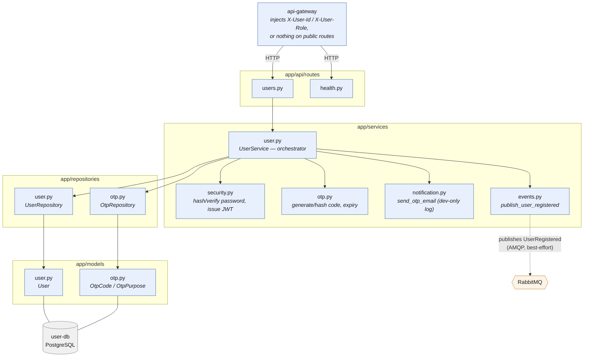

# user-service Architecture

Internal architecture of **user-service** only. For how this service fits
among the others (api-gateway, order-service, credit-service, etc.), see the
repo-root `docs/architecture.md`.

## Style

Layered, matching the monorepo convention: `api/routes` (HTTP) →
`services` (business logic) → `repositories` (persistence) → `models` (ORM).
Two stateless helper services (`security`, `otp`) sit alongside the
orchestrator and have no DB access of their own.

## Components

| Component | File | Responsibility |
| --- | --- | --- |
| Routes | `app/api/routes/users.py` | HTTP ↔ service translation; maps service exceptions to status codes. No business logic. |
| Health | `app/api/routes/health.py` | `GET /health` liveness check. |
| Orchestrator | `app/services/user.py` (`UserService`) | The only component that spans both repositories in one transaction — e.g. `register()` writes a `User` row and an `OtpCode` row together. |
| Security | `app/services/security.py` | Password hashing (`bcrypt`) and JWT issuance (`sub`/`role`/`exp` — must match api-gateway's verifier). Stateless. |
| OTP codes | `app/services/otp.py` | Generate/hash a 6-digit code, compute its 5-minute expiry. Stateless. |
| Notification | `app/services/notification.py` | `send_otp_email()` — dev-only log today; the wiring point for a real mailer or notification-service later. |
| Events | `app/services/events.py` | The only component that talks to RabbitMQ. Publishes `UserRegistered`; best-effort (a broker outage never blocks a request). |
| Exceptions | `app/services/exceptions.py` | Domain errors (`EmailAlreadyRegisteredError`, `InvalidOtpError`, etc.) — routes catch these, never raw ones from repositories. |
| User repository | `app/repositories/user.py` | CRUD on `User` rows. |
| OTP repository | `app/repositories/otp.py` | CRUD on `OtpCode` rows; `mark_consumed()` is an atomic conditional `UPDATE` used to close a verify-race. |
| Models | `app/models/user.py`, `app/models/otp.py` | SQLAlchemy ORM: `User`, `OtpCode`/`OtpPurpose`. |
| DB session | `app/db.py` | Async SQLAlchemy engine/session against `user-db` (PostgreSQL). |

## Diagram

### Title: user-service internal layers and external boundaries

### Legend

| Symbol | Meaning |
| --- | --- |
| Rounded box (blue) | In-process, synchronous component |
| Hexagon (orange) | Asynchronous component — the RabbitMQ broker |
| Cylinder (grey) | The `user-db` PostgreSQL database |
| Solid arrow | Direct function call or SQL access |
| Dashed arrow | Asynchronous AMQP publish |

### Explained elements

- **Routes never touch the DB or business rules directly** — they call
  `UserService` and translate its domain exceptions
  (`app/services/exceptions.py`) into HTTP status codes. This keeps the
  401/403/404/409/400 mapping in one place instead of scattered across
  handlers.
- **`UserService` is the only orchestrator.** It's the one place that
  commits a `User` row and an `OtpCode` row as part of the same logical
  operation (`register`, `resend_otp`), and the one place that decides the
  order of side effects — e.g. `verify_email()` only publishes
  `UserRegistered` *after* `mark_consumed()` confirms this request won the
  atomic claim on the OTP row, not before.
- **`security.py` and `otp.py` are pure/stateless** — no session, no I/O.
  They're safe to unit-test without a DB and safe to call from anywhere in
  `services` without worrying about transaction boundaries.
- **`notification.py` and `events.py` are the service's only two external
  side-effect boundaries** (besides the DB): one talks to an email
  provider (currently stubbed as a log line), the other to RabbitMQ. Both
  are isolated behind a single function so swapping the real mailer in, or
  hardening the broker call with retries, touches one file each.
- **Identity on `/users/me` comes from `X-User-Id`, injected by the
  gateway** — user-service never decodes a JWT itself. The gateway is the
  system's sole JWT verifier; this service only issues tokens (`login`) and
  trusts headers on the way back in.