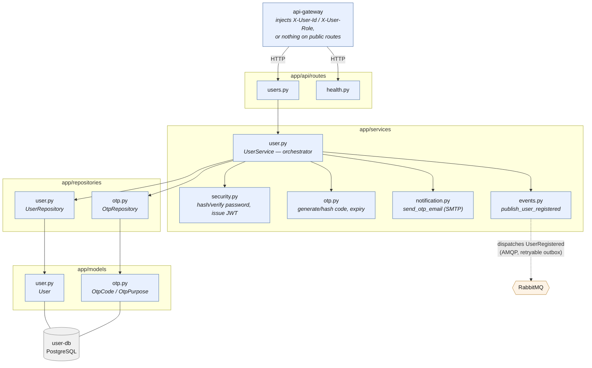
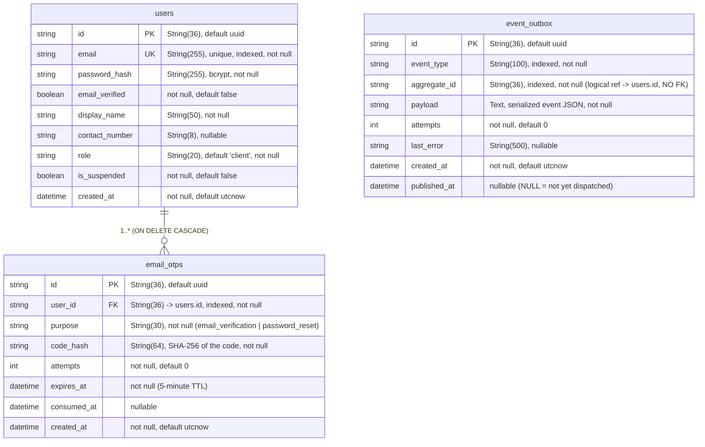

# user-service Architecture

Internal architecture of **user-service** only. For how this service fits
among the others (api-gateway, order-service, credit-service, etc.), see the
repo-root `docs/architecture.md`.

## Style

Layered, matching the monorepo convention: `api/routes` (HTTP) →
`services` (business logic) → `repositories` (persistence) → `models` (ORM).
Two stateless helper services (`security`, `otp`) sit alongside the
orchestrator and have no DB access of their own.

## Components

| Component | File | Responsibility |
| --- | --- | --- |
| Routes | `app/api/routes/users.py` | HTTP ↔ service translation; maps service exceptions to status codes. No business logic. |
| Health | `app/api/routes/health.py` | `GET /health` liveness check. |
| Orchestrator | `app/services/user.py` (`UserService`) | The only component that spans both repositories in one transaction — e.g. `register()` writes a `User` row and an `OtpCode` row together. |
| Security | `app/services/security.py` | Password hashing (`bcrypt`) and JWT issuance (`sub`/`role`/`exp` — must match api-gateway's verifier). Stateless. |
| OTP codes | `app/services/otp.py` | Generate/hash a 6-digit code, compute its 5-minute expiry. Stateless. |
| Notification | `app/services/notification.py` | `send_otp_email()` — sends through the configured SMTP provider without logging OTP values. |
| Events | `app/services/events.py` | Stores `UserRegistered` in a transactional outbox and retries RabbitMQ delivery in the background. |
| Exceptions | `app/services/exceptions.py` | Domain errors (`EmailAlreadyRegisteredError`, `InvalidOtpError`, etc.) — routes catch these, never raw ones from repositories. |
| User repository | `app/repositories/user.py` | CRUD on `User` rows. |
| OTP repository | `app/repositories/otp.py` | CRUD on `OtpCode` rows; `mark_consumed()` is an atomic conditional `UPDATE` used to close a verify-race. |
| Models | `app/models/user.py`, `app/models/otp.py` | SQLAlchemy ORM: `User`, `OtpCode`/`OtpPurpose`. |
| DB session | `app/db.py` | Async SQLAlchemy engine/session against `user-db` (PostgreSQL); startup creates the schema and optionally performs idempotent first-admin bootstrap. |

## Diagram

### Title: user-service internal layers and external boundaries

```mermaid
flowchart TD
    GW["api-gateway<br/><i>injects X-User-Id / X-User-Role,<br/>or nothing on public routes</i>"]

    subgraph API["app/api/routes"]
        Routes["users.py"]
        Health["health.py"]
    end

    subgraph SVC["app/services"]
        US["user.py<br/><i>UserService — orchestrator</i>"]
        SEC["security.py<br/><i>hash/verify password, issue JWT</i>"]
        OTP["otp.py<br/><i>generate/hash code, expiry</i>"]
        NOTIF["notification.py<br/><i>send_otp_email (SMTP)</i>"]
        EVT["events.py<br/><i>publish_user_registered</i>"]
    end

    subgraph REPO["app/repositories"]
        UREPO["user.py<br/><i>UserRepository</i>"]
        OREPO["otp.py<br/><i>OtpRepository</i>"]
    end

    subgraph MODEL["app/models"]
        UM["user.py<br/><i>User</i>"]
        OM["otp.py<br/><i>OtpCode / OtpPurpose</i>"]
    end

    DB[("user-db<br/>PostgreSQL")]
    MQ{{"RabbitMQ"}}

    GW -->|HTTP| Routes
    GW -->|HTTP| Health

    Routes --> US
    US --> SEC
    US --> OTP
    US --> NOTIF
    US --> EVT
    US --> UREPO
    US --> OREPO

    UREPO --> UM
    OREPO --> OM
    UM --- DB
    OM --- DB

    EVT -.->|"dispatches UserRegistered<br/>(AMQP, retryable outbox)"| MQ

    classDef sync fill:#e8f0fe,stroke:#4a6fa5,color:#1a1a1a;
    classDef async fill:#fdf3e6,stroke:#b8863a,color:#1a1a1a;
    classDef store fill:#f0f0f0,stroke:#888,color:#1a1a1a;
    class GW,Routes,Health,US,SEC,OTP,NOTIF,EVT,UREPO,OREPO,UM,OM sync;
    class MQ async;
    class DB store;
```

### Legend

| Symbol | Meaning |
| --- | --- |
| Rounded box (blue) | In-process, synchronous component |
| Hexagon (orange) | Asynchronous component — the RabbitMQ broker |
| Cylinder (grey) | The `user-db` PostgreSQL database |
| Solid arrow | Direct function call or SQL access |
| Dashed arrow | Asynchronous AMQP publish |

### Explained elements

- **Routes never touch the DB or business rules directly** — they call
  `UserService` and translate its domain exceptions
  (`app/services/exceptions.py`) into HTTP status codes. This keeps the
  401/403/404/409/400 mapping in one place instead of scattered across
  handlers.
- **`UserService` is the only orchestrator.** It's the one place that
  commits a `User` row and an `OtpCode` row as part of the same logical
  operation (`register`, `resend_otp`), and the one place that decides the
  order of side effects — e.g. `verify_email()` only publishes
  `UserRegistered` *after* `mark_consumed()` confirms this request won the
  atomic claim on the OTP row, not before.
- **`security.py` and `otp.py` are pure/stateless** — no session, no I/O.
  They're safe to unit-test without a DB and safe to call from anywhere in
  `services` without worrying about transaction boundaries.
- **`notification.py` and `events.py` are the service's only two external
  side-effect boundaries** (besides the DB): one talks to the configured SMTP
  provider, the other dispatches a transactional RabbitMQ outbox. OTP values
  are never logged, and broker outages leave a durable retryable record while
  the dispatcher logs failures at error level.
- **First-admin bootstrap runs during startup only when both bootstrap
  credentials are configured.** It validates the same admin request schema,
  uses application password hashing, is idempotent, and takes a PostgreSQL
  advisory lock so concurrent instances cannot create duplicate admins.
- **Identity on `/api/users/me` comes from `X-User-Id`, injected by the
  gateway** — user-service never decodes a JWT itself. The gateway is the
  system's sole JWT verifier; this service only issues tokens (`login`) and
  trusts headers on the way back in.

## Data model

### Title: user-db entity–relationship diagram (`users`, `email_otps`, `event_outbox`)

<!-- AI-influenced: diagram drafted with OpenCode (Claude Opus); see ai/usage-log.md -->

Every column below is taken directly from the ORM models in `app/models/`
(`user.py`, `otp.py`, `outbox.py`). Types are the SQLAlchemy column types; the
key annotations (PK / FK / unique / index) match the `mapped_column(...)`
options.

```mermaid
erDiagram
    users ||--o{ email_otps : "1..* (ON DELETE CASCADE)"

    users {
        string   id            PK "String(36), default uuid"
        string   email         UK "String(255), unique, indexed, not null"
        string   password_hash    "String(255), bcrypt, not null"
        boolean  email_verified   "not null, default false"
        string   display_name     "String(50), not null"
        string   contact_number   "String(8), nullable"
        string   role             "String(20), default 'client', not null"
        boolean  is_suspended     "not null, default false"
        datetime created_at       "not null, default utcnow"
    }

    email_otps {
        string   id          PK "String(36), default uuid"
        string   user_id     FK "String(36) -> users.id, indexed, not null"
        string   purpose        "String(30), not null (email_verification | password_reset)"
        string   code_hash      "String(64), SHA-256 of the code, not null"
        int      attempts       "not null, default 0"
        datetime expires_at     "not null (5-minute TTL)"
        datetime consumed_at    "nullable"
        datetime created_at     "not null, default utcnow"
    }

    event_outbox {
        string   id            PK "String(36), default uuid"
        string   event_type    "String(100), indexed, not null"
        string   aggregate_id  "String(36), indexed, not null (logical ref -> users.id, NO FK)"
        string   payload       "Text, serialized event JSON, not null"
        int      attempts      "not null, default 0"
        string   last_error    "String(500), nullable"
        datetime created_at    "not null, default utcnow"
        datetime published_at  "nullable (NULL = not yet dispatched)"
    }
```

### Legend

| Notation | Meaning |
| --- | --- |
| `PK` | Primary key. |
| `FK` | Foreign key (enforced database relationship). |
| `UK` | Unique constraint (also indexed). |
| `users \|\|--o{ email_otps` | One user has zero-or-more OTP rows; the FK is `ON DELETE CASCADE`. |
| No connector to `event_outbox` | `aggregate_id` is a **logical** reference to `users.id` with **no** database foreign key (deliberate — see below). |

### Explained elements

- **OTP codes are stored hashed, never in clear.** `email_otps.code_hash` holds
  the SHA-256 of the 6-digit code (`app/services/otp.py::hash_code`), so a
  database leak does not reveal a live verification code. `attempts` +
  `expires_at` (5-minute TTL) + `consumed_at` back the rate-limit,
  expiry, and single-use (`mark_consumed`) rules.
- **`email_otps.user_id` is a real FK with `ON DELETE CASCADE`** — deleting a
  user removes their OTP rows automatically, so no orphaned codes linger. It is
  indexed because every verify/resend looks up the latest code *by user*.
- **`event_outbox` implements the transactional-outbox pattern.** When
  `verify_email()` flips `email_verified` to true, it inserts an outbox row in
  the **same transaction** (`app/services/events.py::enqueue_user_registered`),
  so the fact "this user is verified" and the intent "tell the rest of the
  system" commit atomically. A background relay (`outbox_worker`) later publishes
  unsent rows (`published_at IS NULL`) to RabbitMQ and stamps `published_at`,
  retrying on failure via `attempts` / `last_error`. This guarantees the
  `UserRegistered` event survives a broker outage.
- **`event_outbox.aggregate_id` has no foreign key on purpose.** The outbox is a
  generic event log keyed by the aggregate that produced the event; coupling it
  to `users` with a hard FK would block that reuse and complicate row cleanup.
  It is indexed for lookups but references `users.id` only logically.
