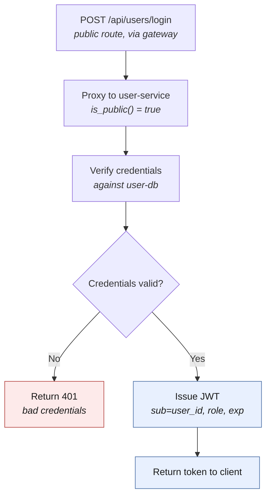
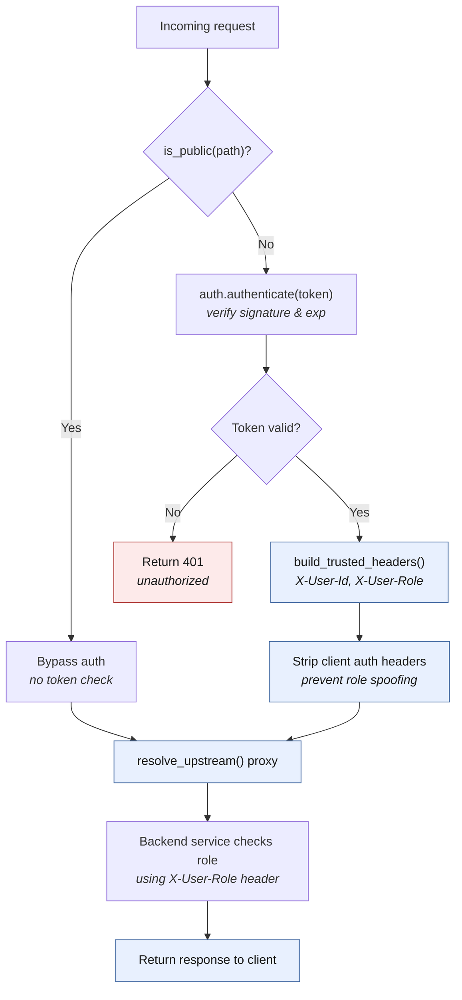
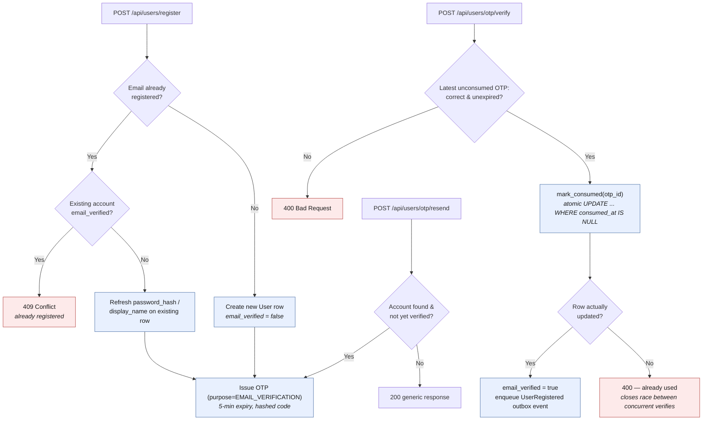

# Authentication & Request Flow

Companion to `architecture.md`, zoomed in on the api-gateway ↔ user-service
auth handshake and the per-request flow every other call goes through.

## 1. Login flow

### Title: Client login through the gateway to user-service

**Legend:** blue = handled by user-service on the happy path; red = rejected.

**Explained elements**

- The gateway does **no** credential checking here — `is_public()` matches
  `/api/users/login` and the request is proxied straight through
  (`api-gateway/app/auth.py`).
- user-service hashes-and-compares the password (`bcrypt`) and, only on
  success, issues a JWT (`app/services/security.py::issue_access_token`)
  with `sub`/`role`/`exp` claims — the exact shape the gateway later expects.
- Login fails closed for unverified or suspended accounts (see
  `app/services/user.py::authenticate`) even with a correct password.

## 2. Per-request auth flow (protected routes)

### Title: Gateway request pipeline grounded in api-gateway/app/{auth,main}.py

**Legend:** blue = handled by the gateway (or downstream, once forwarded);
red = rejected at the gateway.

**Explained elements**

- The gateway never re-derives a role decision per route today —
  `routing.py`'s `ROUTE_TABLE` is a plain path-prefix map with no role
  metadata. It authenticates and injects identity; **RBAC enforcement for a
  specific action happens inside the backend service**, using the trusted
  `X-User-Role` header.
- `authenticate()` never raises on a bad token — it returns `None`, and the
  proxy in `main.py` turns that into a 401. A malformed/expired JWT can't
  crash the gateway.
- `Authorization` is stripped before forwarding, same as any client-supplied
  `X-User-*` header — backends must not see the raw token or be able to
  spoof identity via headers.

> **Known failure mode (hit this once already):** `is_public(path)` in
> `api-gateway/app/auth.py` matches by exact string against
> `PUBLIC_PREFIXES`. That list is currently:
> `/health`, `/api/users/register`, `/api/users/login`,
> `/api/users/otp/verify`, `/api/users/otp/resend`. If user-service's route
> paths ever change (they were renamed once already, from `/verify-otp` /
> `/resend-otp` to `/otp/verify` / `/otp/resend`), the gateway's allowlist
> does **not** update itself — it silently starts requiring a JWT for a
> route the caller has no token for yet, breaking registration/verification
> with no obvious error on the user-service side (its own tests still pass,
> since they bypass the gateway entirely). Whoever renames a user-service
> auth-adjacent route must update `PUBLIC_PREFIXES` in the same PR.

## 3. OTP lifecycle (register → resend → verify)

### Title: Email-verification OTP handling in user-service

**Explained elements**

- Re-registering an email that exists but was never verified does **not**
  409 — it refreshes that row's password/display name and issues a new OTP.
  This is intentional (see prior discussion): someone who lost the first
  code, or mistyped their password, isn't permanently locked out of their
  own `@u.nus.edu` address.
- Resending an OTP always returns the same `200` response for an unknown,
  verified, or unverified address. A code is sent only for an existing,
  unverified account, preventing email enumeration.
- Verification only ever checks the **latest** unconsumed OTP for that user
  (`OtpRepository.get_latest_unconsumed`, ordered by `created_at`), so an
  older code from a previous register/resend simply fails the hash
  comparison — no separate invalidation step is needed.
- `mark_consumed` is a single `UPDATE ... WHERE consumed_at IS NULL`, and
  `verify_email` checks its row-count. This closes a real race: two
  concurrent `verify-otp` requests with the same valid code can no longer
  both succeed — only the one that wins the atomic update proceeds to set
  `email_verified = true` and enqueue `UserRegistered`; the other gets
  "code already used."
- `OtpCode.purpose` (`OtpPurpose.EMAIL_VERIFICATION` today,
  `PASSWORD_RESET` reserved) means the same table and repository can back a
  future forgot-password flow without a schema change.

## 4. First-admin bootstrap

On startup, the lifespan hook creates the schema and checks
`BOOTSTRAP_ADMIN_EMAIL` and `BOOTSTRAP_ADMIN_PASSWORD`. If both are present,
the service validates them with `CreateAdminRequest` and calls
`UserService.ensure_bootstrap_admin()`. The operation is idempotent: an
existing admin is returned unchanged, an existing non-admin with that email
fails startup, and PostgreSQL advisory locking prevents duplicate creation
when multiple instances start together. The password is never reset on later
starts.
